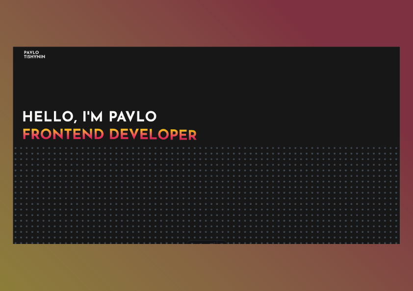

# PORTFOLIO



This is my portfolio. Here you can see all my projects what I did and what I planing to do. All project is builded on __Astro.js__ framework, only one component is use __Svelte__ framework, for animation I use __Green Sock Animation Platform__. Also in this project I create Content Management System with __Sanity.io__. So basically you can change content without code changing.


## Project Structure

```text
/
├── github/workflows/           # github deploy, which help you to deploy yours app with Github Pages
│   └── deploy.yml  
├── lib/
│   └── api.js                  # Service Query with GROQ
│   └── urlForImage.js          # function for to open image from data
├── public/                     # Folder with all images and icons
├── sanity-portfolio
│   ├── schemaTypes/            # sanity schemes
│   │   ├── contact.ts
│   │   ├── education.ts
│   │   ├── index.ts
│   │   ├── projects.ts
│   │   ├── service.ts
│   │   ├── skills.ts
│   │   └── tools.ts
│   ├── .eslintrc
│   ├── package-lock.json       # Dependencies of sanity project
│   ├── package.json            # Dependencies of sanity project
│   ├── sanity.cli.ts
│   ├── sanity.config.ts
│   ├── tsconfig.json
│   │ 
│   │ 
│   │ 
├── src/
│   ├── components/             # components/sections of landing page
│   │   ├── About/              # About Section
│   │   │   ├── AboutSection.astro
│   │   │   ├── EducationComponent.astro
│   │   │   ├── LanguageComponent.astro
│   │   │   └── SkillsComponent.astro
│   │   ├── Challenges/         # Challenge Section
│   │   │   ├── ChallengePatish.astro
│   │   │   └── ChallengeSection.astro
│   │   ├── Footer/             # Footer Section
│   │   │   └── FooterSection.astro
│   │   ├── Header/             # Header Section
│   │   │   └── HeaderSection.astro
│   │   ├── Hero/               # Hero Section
│   │   │   ├── DotGrid.svelte   #Animation of dots on hero page
│   │   │   └── HeroSection.astro 
│   │   ├── Projects/           # Project Section
│   │   │   ├── ProjectItem.astro 
│   │   │   └── ProjectSection.astro 
│   │   ├── Service/            # Service Section
│   │   │   └── ServiceSection.astro 
│   ├── layouts/                
│   │   └── Layout.astro
│   └── pages/
│       └── index.astro
├── astro.config.mjs
├── package-lock.json           # Dependencies of main project
├── package.json                # Dependencies of main project
├── tailwind.config.mjs
└── tsconfig.json

```
## Quick Start
### Astro
All commands are run from the root of the project

```
npm install
```
Installs dependencies 
```
npm run dev
```
Starts local dev server at `localhost:4321`

### CMS Sanity

to run CMS you need to open separate terminal
```
cd sanity-portfolio
```
here you go to sanity folder and  all commands run from this folder
```
npm install
```
Installs dependencies 
```
npm run dev
```
Starts local dev server at `localhost:3333`
```
npx sanity deploy
```
with this command you can deploy your cms to Sanity.io


##  What tools I use

- [Astro](https://astro.build/)
- [Svelte](https://svelte.dev/)
- [GSAP](https://gsap.com/)
- [Tailwind CSS](https://tailwindcss.com/)
- [Typescript](https://www.typescriptlang.org/)
- [Render](https://render.com/)
- [Github](https://github.com/)
- [Sanity](https://www.sanity.io/)


## P.S.
If you founded some bugs in my code, please tell me 
- [WhatsApp](https://wa.me/49155515515515)
- [Email](mailto:pashatishinin@gmail.com)
